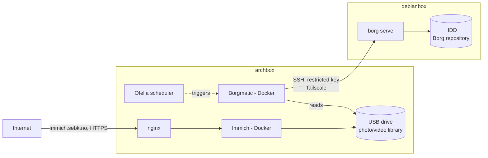

# Immich + Borgmatic Backup

Self-hosted photo/video service (Immich), public-facing with hardened login,
backed up automatically to a second machine via a dockerized Borg/Borgmatic pipeline.

## Architecture



- **archbox** — runs Immich (Docker) and the borgmatic client (Docker). Public-facing.
- **debianbox** — backup target only. Native `borg` install, no Docker needed.
- Connected over **Tailscale** (encrypted, direct).

## Prerequisites

- Docker + Docker Compose on archbox
- `borg` installed natively on debianbox (`apt install borgbackup`) — this is the
  one piece that intentionally isn't dockerized: Borg's SSH transport runs
  `borg serve` directly on the remote host, so containerizing it just adds an
  extra hop for no benefit
- A dedicated SSH keypair for archbox → debianbox, restricted via a forced
  `command="borg serve --restrict-to-path ..."` entry in debianbox's
  `authorized_keys` — this key can never do anything but serve that one repo path
- Tailscale (or equivalent) connectivity between the two hosts
- A domain + reverse proxy (nginx) + TLS cert if exposing Immich publicly

## Deployment

1. **Immich**: standard docker-compose deployment (`~/immich`). Storage location
   set to a dedicated mounted drive, kept separate from the database's own
   storage location.
2. **Public exposure**: nginx reverse proxy → Immich's port, TLS via Let's Encrypt,
   DNS-only (not proxied) if using Cloudflare, to avoid upload size caps.
3. **Login hardening**: Immich has no native 2FA, so rate limiting on the login
   endpoint + a fail2ban jail cover brute-force attempts instead.
4. **Backup pipeline** (archbox): `~/borgmatic/` — see `docker-compose.yml` and
   `config/config.yaml.template` in that folder for the actual definitions.
   Key points, not repeated in full here:
   - `network_mode: host` is required on the borgmatic container — default
     bridge networking can't route to the other host over Tailscale
   - Config is rendered from a template via `.env` + `envsubst`
     (`render-config.sh`), so no real paths/hosts/secrets are committed to git
   - Scheduling is via Ofelia labels on the compose file, not a crontab file
   - A pre-backup hook dumps the database fresh before every snapshot, rather
     than relying on the app's own periodic dump job
5. **Init + first run**:
   ```bash
   docker compose up -d
   docker exec borgmatic borgmatic repo-create --encryption repokey-blake2
   docker exec borgmatic borgmatic create --stats --verbosity 1
   ```

## How it works (short version)

Each run: dump the DB → chunk the source files → skip any chunk already in the
repo (deduplication) → compress + encrypt what's new → send to debianbox → prune
anything past the retention window. Every backup is a complete, independently
restorable snapshot — not a diff chain.

## Restore

```bash
docker exec borgmatic borgmatic list                          # see archives
docker exec borgmatic borgmatic extract --archive <name> --destination /tmp/restore
```
Then restore files (`rsync` into the live storage path) and the database
(`psql` from the dump inside the extracted archive) together — they need to
come from the same archive to stay consistent with each other.

## Known open items

- Archbox's SSH (port 22) is currently unreachable from any source — services
  (Immich, Nextcloud, nginx) are unaffected, this is isolated to remote admin
  access. Requires physical access to diagnose (firewall rule or sshd state).
- Confirm `DB_PASSWORD` was rotated from its placeholder value.
- Confirm `X-Forwarded-Proto`/`X-Forwarded-For` headers are present in the nginx vhost.
